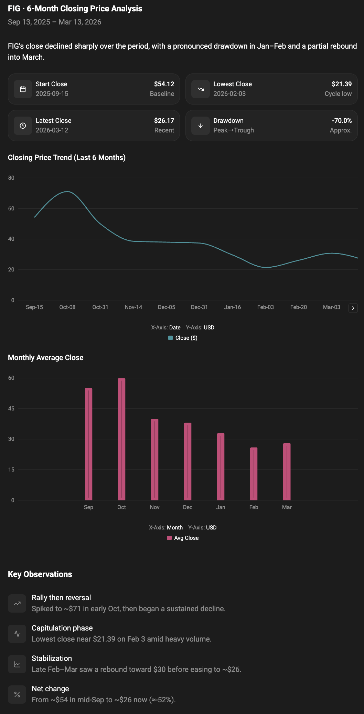
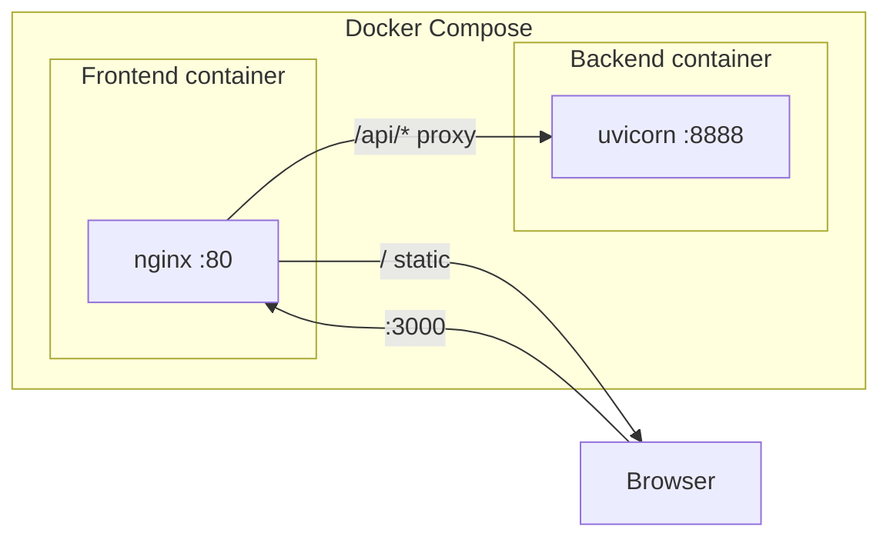

# Stock Analysis

AI-powered stock assistant with real-time and historical market data, built as a full-stack application with a Python backend and Vite/React frontend.



---

## Overview

This is a full-stack application that lets users chat with an AI assistant to query stock prices, historical data, balance sheets, and news. The **backend** is a Python FastAPI service using LangChain and LangGraph with yfinance for market data; the **frontend** is a React app (Vite + TypeScript) that talks to the backend over HTTP. The stack is **Dockerized** and uses **nginx** as a reverse proxy in production so the browser only hits one origin.

The project is based on the [NeuralNine](https://www.youtube.com/@NeuralNine) tutorial [_Building a Stock Analysis Chatbot_](https://www.youtube.com/watch?v=AE_6F8cuXsA). It was extended with:

- Docker and Docker Compose for frontend and backend
- nginx in the frontend container to serve the SPA and proxy `/api/*` to the backend
- Improved local and dev setup (Vite proxy, health endpoint, CORS)

---

## Features

- **Chat with an AI stock assistant** — Natural-language queries answered by an LLM backed by Thesys API
- **Real-time and historical prices** — Current and historical stock data via yfinance
- **Balance sheet and news** — Balance sheet and news tools available to the agent
- **Streaming responses** — Chat replies streamed as server-sent events (SSE)
- **Docker and nginx** — Single-command run with Docker Compose; nginx proxies API traffic to the backend
- **Health check** — `GET /api/health` for monitoring and connectivity checks

---

## Tech Stack

| Layer              | Technologies                                                                                                                                                                   |
| ------------------ | ------------------------------------------------------------------------------------------------------------------------------------------------------------------------------ |
| **Backend**        | Python 3.13, FastAPI, LangChain, LangGraph, yfinance, pandas, uv, uvicorn; [Thesys](https://www.thesys.dev/) API for the LLM                                                   |
| **Frontend**       | React 19, Vite 8, TypeScript, [@thesysai/genui-sdk](https://www.npmjs.com/package/@thesysai/genui-sdk), [@crayonai/react-ui](https://www.npmjs.com/package/@crayonai/react-ui) |
| **Infrastructure** | Docker, Docker Compose, nginx (inside the frontend image)                                                                                                                      |

---

## Architecture

In **Docker**, the browser talks only to the frontend container (host port 3000 → nginx on 80). nginx serves the built SPA for `/` and proxies `/api/*` to the backend container (uvicorn on 8888). Both services share a single Compose network (`app`), so nginx resolves the backend by service name `backend`.

In **local dev** (no Docker), the frontend runs with Vite on port 3000 and proxies `/api` to the backend at `http://127.0.0.1:8888`; you run the backend separately on 8888.



---

## Project Structure

```
stock-analysis/
├── backend/
│   ├── main.py           # FastAPI app, LangChain agent, /api/chat, /api/health
│   ├── Dockerfile        # Python 3.13, uv, EXPOSE 8888
│   ├── pyproject.toml    # Dependencies (FastAPI, LangChain, yfinance, etc.)
│   ├── uv.lock
│   └── .env.example      # OPENAI_API_KEY template
├── frontend/
│   ├── src/              # React app (App.tsx, etc.)
│   ├── nginx.conf        # nginx config: static + proxy_pass /api/ to backend:8888
│   ├── Dockerfile        # Node build → nginx serve, EXPOSE 80
│   ├── vite.config.ts    # dev server port 3000, proxy /api → 127.0.0.1:8888
│   └── package.json
├── assets/
│   └── images/
│       └── screenshot.png
└── docker-compose.yml    # backend + frontend, network app, ports 8888 and 3000
```

---

## How It Works

1. The user types in the chat UI; the frontend sends a `POST` to `/api/chat` with the message and thread metadata.
2. In Docker, nginx (frontend container) receives the request and proxies it to `http://backend:8888/api/chat`. Locally, Vite’s dev server proxies `/api` to `http://127.0.0.1:8888`.
3. The backend runs a LangChain/LangGraph agent with tools for stock price, historical price, balance sheet, and news (yfinance). The LLM is configured to use Thesys’s API (`base_url` in code); the API key is read from `OPENAI_API_KEY` in `backend/.env`.
4. The backend streams the reply as server-sent events; the frontend consumes the stream and updates the UI.

---

## Environment Variables

| Variable         | Location       | Required | Description                                                                                                                                                                                                            |
| ---------------- | -------------- | -------- | ---------------------------------------------------------------------------------------------------------------------------------------------------------------------------------------------------------------------- |
| `OPENAI_API_KEY` | `backend/.env` | Yes      | **Thesys** API key. The backend uses LangChain’s OpenAI client, which reads this variable; the app is configured to call [Thesys](https://www.thesys.dev/) (not OpenAI directly). Get a key at https://www.thesys.dev/ |

---

## Environment Setup

1. Copy the example env file into place:
   ```bash
   cp backend/.env.example backend/.env
   ```
2. Get a Thesys API key from **https://www.thesys.dev/** and set it in `backend/.env`:
   ```bash
   OPENAI_API_KEY="your_thesys_api_key_here"
   ```
3. Save the file. Do not commit `backend/.env` (it is listed in `.gitignore`).

---

## Setup Instructions

1. Clone the repository.
2. Complete [Environment setup](#environment-setup) above (create `backend/.env` and add your Thesys API key).
3. Choose one of the run options below:
   - [Running with Docker](#running-with-docker--docker-compose) (recommended)
   - [Running locally without Docker](#running-locally-without-docker)

---

## Running Locally Without Docker

**Prerequisites:** Python 3.13+, Node 20+, [uv](https://docs.astral.sh/uv/).

1. **Start the backend** (must be running before the frontend so the proxy can reach it):

   ```bash
   cd backend
   uv sync
   uv run main.py
   ```

   Backend listens on **http://127.0.0.1:8888**.

2. **Start the frontend** (in another terminal):

   ```bash
   cd frontend
   npm install
   npm run dev
   ```

   Frontend runs on **http://localhost:3000** and proxies `/api` to `http://127.0.0.1:8888`.

3. Open **http://localhost:3000** in your browser.

---

## Running with Docker / Docker Compose

Ensure `backend/.env` exists with `OPENAI_API_KEY` set (see [Environment setup](#environment-setup)). The backend container mounts `./backend` into `/app`, so `load_dotenv()` in `main.py` loads `.env` from the host’s `backend/` directory.

**Build and run:**

```bash
docker compose build
docker compose up -d
```

Or build and run in one step:

```bash
docker compose up --build -d
```

- **App (frontend + proxy):** http://localhost:3000
- **Backend API (e.g. health):** http://localhost:8888 (e.g. http://localhost:8888/api/health)

---

## Ports Used by Each Service

| Service          | Container port | Host port | Purpose                          |
| ---------------- | -------------- | --------- | -------------------------------- |
| Backend          | 8888           | 8888      | FastAPI/uvicorn API              |
| Frontend (nginx) | 80             | 3000      | SPA + reverse proxy for `/api/*` |

---

## Reverse Proxy (nginx)

In the Docker setup, the **frontend** container runs nginx, which:

- Serves the built React app from `/usr/share/nginx/html` for path `/`.
- Uses `try_files $uri $uri/ /index.html` so client-side routing works (SPA fallback).
- Proxies **`/api/`** to `http://backend:8888` with the **full request URI** (e.g. `/api/chat`). The `proxy_pass` directive has no trailing slash so the path is not rewritten.
- Disables buffering and sets timeouts so streaming (SSE) for `/api/chat` works correctly.

The browser only needs to talk to `http://localhost:3000`; nginx forwards API traffic to the backend on the Docker network.

---

## API / Frontend–Backend Interaction

- The frontend uses a **relative** API base: `apiUrl="/api/chat"` in the chat component, so requests go to the same origin (e.g. `http://localhost:3000/api/chat`).
- **In Docker:** That request hits nginx, which proxies to `http://backend:8888/api/chat`. Backend and frontend communicate using the Compose service name `backend` on the shared network `app`.
- **Locally:** Vite’s dev server proxies `/api` to `http://127.0.0.1:8888`, so the backend receives `/api/chat` and `/api/health` as usual.

**Backend routes:**

- `GET /api/health` — Returns `{"status": "ok"}` for health checks.
- `POST /api/chat` — Accepts a JSON body (prompt, threadId, responseId) and streams the assistant reply as SSE.

---

## Troubleshooting

| Issue                             | What to check                                                                                                                                                                                                                                             |
| --------------------------------- | --------------------------------------------------------------------------------------------------------------------------------------------------------------------------------------------------------------------------------------------------------- |
| **404 on `/api/*`**               | Ensure nginx `proxy_pass` has **no** trailing slash (so the path is not stripped). Ensure backend and frontend are on the same Docker network (`app`). Rebuild frontend after changing `frontend/nginx.conf`: `docker compose build --no-cache frontend`. |
| **CORS errors**                   | Backend uses permissive CORS; if you still see issues, confirm the request origin matches what the backend allows.                                                                                                                                        |
| **Connection refused to backend** | **Docker:** Ensure the backend container is up and that nginx can resolve `backend:8888`. **Local:** Start the backend first (`uv run main.py` in `backend/`) and confirm it listens on 8888 before starting the frontend.                                |
| **Missing or invalid API key**    | Ensure `backend/.env` exists with `OPENAI_API_KEY` set to your **Thesys** key from https://www.thesys.dev/. For Docker, `.env` is loaded from the mounted `./backend` directory.                                                                          |
| **Config changes not applied**    | After editing `frontend/nginx.conf` or frontend Dockerfile, run `docker compose build --no-cache frontend` and then `docker compose up -d`.                                                                                                               |

---

## Future Improvements

- Add tests (e.g. backend API tests, frontend component or E2E tests).
- Add CI (build and test on push).
- Optional env-based API base URL for the frontend (e.g. `VITE_API_BASE`) for different environments.
- Rate limiting on the backend or at the proxy.
- Production nginx tuning (SSL, timeouts, logging).

---

## Credits

Based on the [NeuralNine](https://www.youtube.com/@NeuralNine) tutorial [_Building a Stock Analysis Chatbot_](https://www.youtube.com/watch?v=AE_6F8cuXsA). Extended with Docker, nginx reverse proxy, and improved local development setup.
